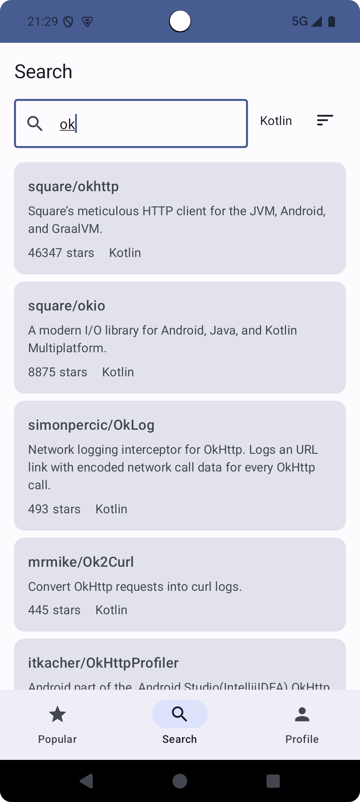
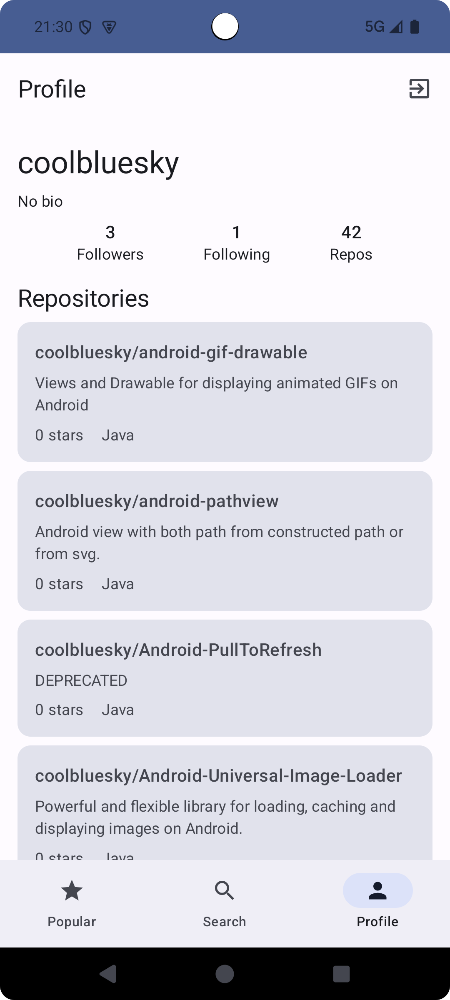
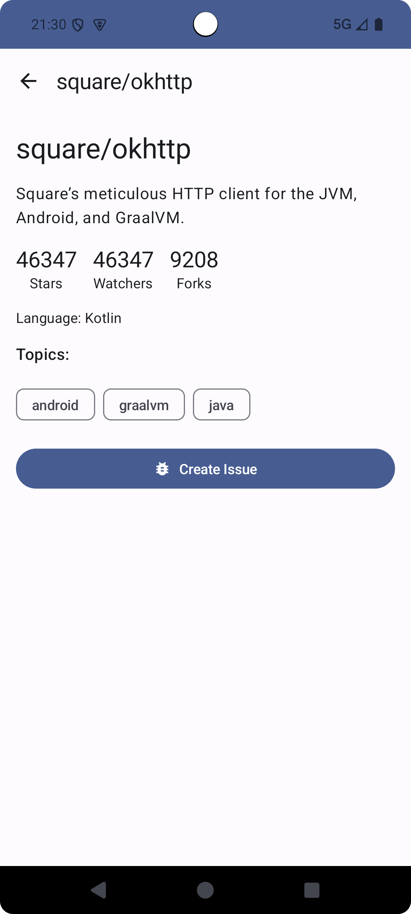
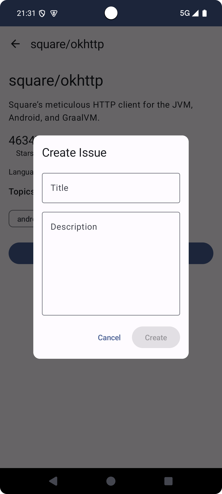

# MyGithubOS

一个基于 GitHub API 的简单Android 应用
<div style="display: flex; justify-content: space-around;">
    
    
    
</div>

<div style="display: flex; justify-content: space-around;">
    
    
    <p  style="width: 30%;"/>
</div>

## 功能特性

- 查看热门仓库列表
- 仓库搜索
- 使用 GitHub OAuth 进行身份验证
- 查看个人资料和仓库列表
- 查看仓库详情
- 创建 Issue

## 技术栈

- **语言**: Kotlin
- **UI**: Jetpack Compose, Material Design, ViewModel
- **依赖注入**: Hilt
- **异步处理**: Kotlin Coroutines & Flow
- **网络请求**: Retrofit + OkHttp
- **本地安全存储**: Jetpack EncryptedSharedPreferences

## 项目结构

```
app/src/main/java/com/example/mygithubos/
├── data/                    # 数据层
│   ├── api/                # API 接口定义
│   ├── auth/               # 认证相关
│   ├── local/              # 本地数据存储
│   ├── model/              # 数据模型
│   └── repository/         # 仓库实现
├── domain/                  # 领域层
│   ├── repository/         # 仓库接口
│   └── usecase/            # 用例
├── ui/                      # 表现层
│   ├── components/         # 可复用组件
│   ├── navigation/         # 导航
│   ├── screens/            # 页面
│   │   ├── login/         # 登录页面
│   │   ├── main/          # 主页面
│   │   ├── popular/       # 热门仓库
│   │   ├── repo_details/  # 仓库详情
│   │   ├── search/        # 搜索页面
│   │   └── user_profile/  # 用户资料
│   └── theme/              # 主题
├── di/                      # 依赖注入
├── GitHubApplication.kt     # 应用程序入口
└── MainActivity.kt          # 主活动
```


## 开发环境要求

- Android Studio Hedgehog | 2023.1.1 或更高版本
- JDK 8 或更高版本
- Android SDK 33
- Gradle 8.2

## APK下载
点击直接下载[MyGitHubOSApp-debug.apk](attachment/MyGitHubOSApp-debug.apk)
(注意apk是一个debug签名的包)

apk资源位于：attachment/MyGitHubOSApp-debug.apk

