# MyGithubOS

一个基于 GitHub API 的简单Android 应用
<div style="display: flex; justify-content: space-around;">
    
    
    
</div>
<p/>
<div style="display: flex; justify-content: space-around;">
    
    
    <p  style="width: 30%;"/>
</div>

## 功能特性

- 查看热门仓库列表
- 仓库搜索
- 使用 GitHub OAuth 进行身份验证
- 查看个人资料和仓库列表
- 查看仓库详情
- 创建 Issue

## 技术栈

- **语言**: Kotlin
- **UI**: Jetpack Compose, Material Design, ViewModel
- **依赖注入**: Hilt
- **异步处理**: Kotlin Coroutines & Flow
- **网络请求**: Retrofit + OkHttp
- **本地安全存储**: Jetpack EncryptedSharedPreferences

## 项目结构

```
app/src/main/java/com/example/mygithubos/
├── data/                    # 数据层
│   ├── api/                # API 接口定义
│   ├── auth/               # 认证相关
│   ├── local/              # 本地数据存储
│   ├── model/              # 数据模型
│   └── repository/         # 仓库实现
├── domain/                  # 领域层
│   ├── repository/         # 仓库接口
│   └── usecase/            # 用例
├── ui/                      # 表现层
│   ├── components/         # 可复用组件
│   ├── navigation/         # 导航
│   ├── screens/            # 页面
│   │   ├── login/         # 登录页面
│   │   ├── main/          # 主页面
│   │   ├── popular/       # 热门仓库
│   │   ├── repo_details/  # 仓库详情
│   │   ├── search/        # 搜索页面
│   │   └── user_profile/  # 用户资料
│   └── theme/              # 主题
├── di/                      # 依赖注入
├── GitHubApplication.kt     # 应用程序入口
└── MainActivity.kt          # 主活动
```
## 项目架构
架构遵循 Clean Architecture 的原则，并实现了清晰的职责划分。

```mermaid
classDiagram
    %% 表现层 - Screens
    class MainActivity {
        +onCreate()
    }
    
    class MainScreen {
        +MainScreen()
    }
    
    class NavGraph {
        +NavGraph()
    }
    
    class LoginScreen {
        +LoginScreen()
    }
    
    class PopularRepositoriesScreen {
        +PopularRepositoriesScreen()
    }
    
    class SearchScreen {
        +SearchScreen()
    }
    
    class RepoDetailsScreen {
        +RepoDetailsScreen()
    }
    
    class UserProfileScreen {
        +UserProfileScreen()
    }
    
    %% 表现层 - ViewModels
    class MainViewModel {
        -isAuthenticatedUseCase: IsAuthenticatedUseCase
        +isAuthenticated: Flow<Boolean>
    }
    
    class SearchViewModel {
        -searchRepositoriesUseCase: SearchRepositoriesUseCase
        +searchRepositories()
        +setLanguage()
        +setSortBy()
    }
    
    class RepoDetailsViewModel {
        -getRepositoryDetailsUseCase: GetRepositoryDetailsUseCase
        -createIssueUseCase: CreateIssueUseCase
        +loadRepositoryDetails()
        +createIssue()
    }
    
    class PopularRepositoriesViewModel {
        -searchRepositoriesUseCase: SearchRepositoriesUseCase
        +loadPopularRepositories()
    }
    
    class LoginViewModel {
        -loginUseCase: LoginUseCase
        -oAuthService: GitHubOAuthService
        +handleOAuthCallback()
    }
    
    class UserProfileViewModel {
        -getCurrentUserUseCase: GetCurrentUserUseCase
        -getUserRepositoriesUseCase: GetUserRepositoriesUseCase
        -logoutUseCase: LogoutUseCase
        +loadUserProfile()
        +logout()
    }
    
    %% 领域层 - UseCases
    class SearchRepositoriesUseCase {
        -repository: GitHubRepository
        +invoke()
    }
    
    class GetRepositoryDetailsUseCase {
        -repository: GitHubRepository
        +invoke()
    }
    
    class CreateIssueUseCase {
        -repository: GitHubRepository
        +invoke()
    }
    
    class LoginUseCase {
        -repository: GitHubRepository
        +invoke()
    }
    
    class LogoutUseCase {
        -repository: GitHubRepository
        +invoke()
    }
    
    class IsAuthenticatedUseCase {
        -repository: GitHubRepository
        +invoke()
    }
    
    class GetCurrentUserUseCase {
        -repository: GitHubRepository
        +invoke()
    }
    
    class GetUserRepositoriesUseCase {
        -repository: GitHubRepository
        +invoke()
    }
    
    %% 领域层 - Repository Interface
    class GitHubRepository {
        <<interface>>
        +searchRepositories()
        +getRepository()
        +getCurrentUser()
        +login()
        +isAuthenticated()
        +getUserRepositories()
        +logout()
        +createIssue()
    }
    
    %% 数据层
    class GitHubRepositoryImpl {
        -api: GitHubApi
        -oauthService: GitHubOAuthService
        -secureStorage: SecureStorage
        +searchRepositories()
        +getRepository()
        +getCurrentUser()
        +login()
        +isAuthenticated()
        +getUserRepositories()
        +logout()
        +createIssue()
    }
    
    class GitHubApi {
        <<interface>>
        +searchRepositories()
        +getRepository()
        +getCurrentUser()
        +getUserRepositories()
        +createIssue()
    }
    
    class GitHubOAuthService {
        <<interface>>
        +getAccessToken()
    }
    
    class SecureStorage {
        +saveString()
        +getString()
        +remove()
        +clear()
    }
    
    %% 数据模型
    class Repository {
        +id: Long
        +name: String
        +fullName: String
        +description: String
        +owner: User
        +stargazersCount: Int
        +watchersCount: Int
        +forksCount: Int
        +language: String
        +htmlUrl: String
        +defaultBranch: String
        +topics: List<String>
    }
    
    class User {
        +id: Long
        +login: String
        +avatarUrl: String
        +name: String
        +company: String
        +blog: String
        +location: String
        +email: String
        +bio: String
        +publicRepos: Int
        +publicGists: Int
        +followers: Int
        +following: Int
    }
    
    class SearchResponse {
        +totalCount: Int
        +incompleteResults: Boolean
        +items: List<Repository>
    }
    
    class IssueRequest {
        +title: String
        +body: String
    }
    
    class IssueResponse {
        +id: Long
        +number: Int
        +title: String
        +body: String
        +state: String
        +created_at: String
        +updated_at: String
    }
    
    %% 关系
    MainActivity --> MainScreen
    MainScreen --> MainViewModel
    MainScreen --> NavGraph
    NavGraph --> LoginScreen
    NavGraph --> PopularRepositoriesScreen
    NavGraph --> SearchScreen
    NavGraph --> RepoDetailsScreen
    NavGraph --> UserProfileScreen
    
    LoginScreen --> LoginViewModel
    PopularRepositoriesScreen --> PopularRepositoriesViewModel
    SearchScreen --> SearchViewModel
    RepoDetailsScreen --> RepoDetailsViewModel
    UserProfileScreen --> UserProfileViewModel
    
    MainViewModel --> IsAuthenticatedUseCase
    SearchViewModel --> SearchRepositoriesUseCase
    RepoDetailsViewModel --> GetRepositoryDetailsUseCase
    RepoDetailsViewModel --> CreateIssueUseCase
    LoginViewModel --> LoginUseCase
    UserProfileViewModel --> GetCurrentUserUseCase
    UserProfileViewModel --> GetUserRepositoriesUseCase
    UserProfileViewModel --> LogoutUseCase
    PopularRepositoriesViewModel --> SearchRepositoriesUseCase
    
    SearchRepositoriesUseCase --> GitHubRepository
    GetRepositoryDetailsUseCase --> GitHubRepository
    CreateIssueUseCase --> GitHubRepository
    LoginUseCase --> GitHubRepository
    LogoutUseCase --> GitHubRepository
    IsAuthenticatedUseCase --> GitHubRepository
    GetCurrentUserUseCase --> GitHubRepository
    GetUserRepositoriesUseCase --> GitHubRepository
    
    GitHubRepository <|.. GitHubRepositoryImpl
    GitHubRepositoryImpl --> GitHubApi
    GitHubRepositoryImpl --> GitHubOAuthService
    GitHubRepositoryImpl --> SecureStorage
    
    GitHubRepositoryImpl --> Repository
    GitHubRepositoryImpl --> User
    GitHubRepositoryImpl --> SearchResponse
    GitHubRepositoryImpl --> IssueRequest
    GitHubRepositoryImpl --> IssueResponse
```


项目采用 Clean Architecture 架构，主要分为以下几层：

#### 1. 表现层 (Presentation Layer)
- 包含所有的 UI 组件和 ViewModel
- 主要组件：
  - `MainActivity` 和 `MainScreen`: 应用入口
  - `NavGraph`: 导航组件
  - 各个功能页面：
    - `LoginScreen`: 登录页面
    - `PopularRepositoriesScreen`: 热门仓库页面
    - `SearchScreen`: 搜索页面
    - `RepoDetailsScreen`: 仓库详情页面
    - `UserProfileScreen`: 用户资料页面
  - ViewModel:
    - `MainViewModel`: 处理主页面逻辑
    - `SearchViewModel`: 处理仓库搜索逻辑
    - `RepoDetailsViewModel`: 处理仓库详情逻辑
    - `LoginViewModel`: 处理登录逻辑
    - `UserProfileViewModel`: 处理用户资料逻辑
    - `PopularRepositoriesViewModel`: 处理热门仓库列表逻辑

#### 2. 领域层 (Domain Layer)
- 包含业务逻辑和用例
- 主要组件：
  - `UseCase`: 用例接口
  - `SearchRepositoriesUseCase`: 搜索仓库用例
  - `GetRepositoryDetailsUseCase`: 获取仓库详情用例
  - `CreateIssueUseCase`: 创建 Issue 用例
  - `LoginUseCase`: 登录用例
  - `LogoutUseCase`: 登出用例
  - `IsAuthenticatedUseCase`: 检查认证状态用例
  - `GetCurrentUserUseCase`: 获取当前用户用例
  - `GetUserRepositoriesUseCase`: 获取用户仓库用例

#### 3. 数据层 (Data Layer)
- 包含数据源和仓库实现
- 主要组件：
  - `GitHubRepository`: 仓库接口
  - `GitHubRepositoryImpl`: 仓库实现
  - `GitHubApi`: GitHub API 接口
  - `GitHubOAuthService`: OAuth 认证服务
  - `SecureStorage`: 安全存储

#### 4. 数据模型 (Data Models)
- 包含所有数据实体
- 主要模型：
  - `Repository`: 仓库信息
  - `User`: 用户信息
  - `SearchResponse`: 搜索响应
  - `IssueRequest`: Issue 请求
  - `IssueResponse`: Issue 响应

### 依赖关系
- UI 组件依赖于对应的 ViewModel
- ViewModel 依赖于 UseCase
- UseCase 依赖于 Repository 接口
- Repository 实现依赖于具体的数据源
- 数据源依赖于数据模型

## 开发环境要求

- Android Studio Hedgehog | 2023.1.1 或更高版本
- JDK 8 或更高版本
- Android SDK 33
- Gradle 8.2

## APK下载
点击直接下载[MyGitHubOSApp-debug.apk](attachment/MyGitHubOSApp-debug.apk)
(注意apk是一个debug签名的包)

apk资源位于：attachment/MyGitHubOSApp-debug.apk

